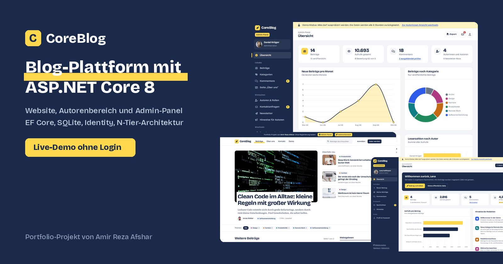
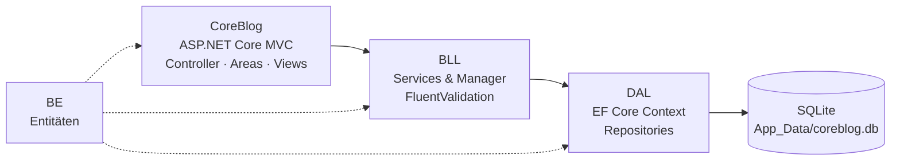

<div align="center">



# CoreBlog

**Mehrautoren-Blog mit öffentlicher Website, Autorenbereich und Admin-Panel**


[Live-Demo](#demo) · [Funktionen](#funktionen) · [Architektur](#architektur) · [Screenshots](#screenshots) · [Lokal starten](#start)

</div>

---

## 📖 Über das Projekt

CoreBlog ist ein Magazin, in dem mehrere Autorinnen und Autoren Beiträge veröffentlichen. Leserinnen und Leser können suchen, filtern, kommentieren und Beiträge mit Sternen bewerten. Die Redaktion verwaltet im Admin-Panel Inhalte, Kommentare, Konten und Rollen.

Das Projekt zeigt eine vollständige **mehrschichtige ASP.NET-Core-Anwendung**: von der Datenbank über die Geschäftslogik bis zur Oberfläche, mit Authentifizierung, Rollen, Validierung, Datei-Upload und Diagrammen.

---

<a id="demo"></a>

## 🎯 Live-Demo

Die Demo funktioniert **ohne Registrierung**: ein Klick, und Sie sind angemeldet.

| Zugang | Adresse | Angemeldet als |
|---|---|---|
| 🛠️ Admin-Panel | `/Demo/Admin` | Daniel Krüger, Chefredakteur |
| 🖋️ Autorenbereich | `/Demo/Writer` | Lena Hoffmann, Autorin |
| 🌐 Übersicht | `/Demo` | – |

> Alle Funktionen dürfen ausprobiert werden. Die Demo-Datenbank wird **alle 6 Stunden automatisch zurückgesetzt**.
> Passwort, Rolle und Status der Demo-Konten sind geschützt, damit die Demo für alle Besucher erreichbar bleibt.

---

<a id="funktionen"></a>

## ✨ Funktionen

<table>
<tr>
<td width="33%" valign="top">

### 🌐 Website
- Startseite mit Titelgeschichte, neuesten und meistgelesenen Beiträgen
- Volltextsuche, Filter nach Kategorien, Seitennavigation
- Beitragsseite mit Inhaltsverzeichnis, Lesezeit und Aufrufzähler
- Kommentare mit **Sternebewertung**
- Autorenseiten, „Über uns“, Kontaktformular
- Newsletter-Anmeldung per AJAX
- Registrierung und Anmeldung
- Eigene 403- und 404-Seiten

</td>
<td width="33%" valign="top">

### 🖋️ Autorenbereich
- Dashboard mit Kennzahlen und Diagramm
- Beiträge schreiben, bearbeiten, löschen
- Entwurf oder sofort veröffentlichen
- **Bild-Upload** mit Vorschau oder Galerie
- Zeichen- und Lesezeitzähler im Editor
- Kommentare zu eigenen Beiträgen
- **Interne Nachrichten** mit Antworten
- Profil, Profilbild, Passwort ändern

</td>
<td width="33%" valign="top">

### 🛠️ Admin-Panel
- Dashboard mit **3 Diagrammen** (Chart.js)
- Alle Beiträge filtern, freigeben, löschen
- Titelgeschichte festlegen, **CSV-Export**
- Kategorien mit eigener Farbe
- Kommentare moderieren
- Autoren sperren, löschen, **Rollen vergeben**
- Kontaktanfragen, Newsletter (CSV)
- Hinweise an Autoren, Seite „Über uns“

</td>
</tr>
</table>

---

<a id="architektur"></a>

## 🏗️ Architektur



```
CoreBlog.sln
├── BE         → Entitäten: Blog, Category, Comment, Writer, Message, AppUser, AppRole …
├── DAL        → Context (SQLite), GenericRepository<T>, Ef…Repository
├── BLL        → I…Service-Schnittstellen, Manager, Validatoren, DI-Registrierung
└── CoreBlog   → Controller, Areas (Admin, Writer), Views, Infrastruktur (Demo, Seed, Upload)
```

**Umgesetzte Konzepte**

| Konzept | Umsetzung |
|---|---|
| N-Tier-Architektur | Getrennte Projekte für Entitäten, Datenzugriff, Geschäftslogik und Oberfläche |
| Repository-Pattern | `GenericRepository<T>` plus spezialisierte Repositories mit `Include`-Abfragen |
| Dependency Injection | Alle Repositories und Manager als *Scoped* registriert – ein Context pro Anfrage |
| Authentifizierung | ASP.NET Core Identity mit den Rollen **Admin** und **Writer** |
| Autorisierung | Areas mit Rollenprüfung, Besitzprüfung bei Beiträgen und Nachrichten |
| Validierung | FluentValidation in der BLL, deutsche Fehlermeldungen |
| Bewertungen | Berechnung in der Geschäftslogik statt SQL-Server-Trigger – datenbankunabhängig |
| Demo-Modus | Ein-Klick-Login, geschützte Demo-Konten, automatischer Reset per `BackgroundService` |

---

## 🧩 Technologien

| Bereich | Technologien |
|---|---|
| Backend | C#, ASP.NET Core 8 MVC, Entity Framework Core 8, ASP.NET Core Identity, FluentValidation |
| Datenbank | SQLite (Datei im Projekt, wird bei Bedarf automatisch angelegt und befüllt) |
| Frontend | Razor Views, HTML, CSS, JavaScript, Bootstrap 5, Chart.js, Font Awesome |
| Deployment | Docker, Render (Region Frankfurt) |

---

<a id="screenshots"></a>

## 🖼️ Screenshots

### 🌐 Website
| Startseite | Beitrag |
|:---:|:---:|
|  |  |
| **Demo-Zugang** | **Anmeldung** |
|  |  |

### 🛠️ Admin-Panel
| Dashboard | Beiträge |
|:---:|:---:|
|  |  |
| **Kommentare moderieren** | **Autoren & Rollen** |
|  |  |

### 🖋️ Autorenbereich
| Dashboard | Editor |
|:---:|:---:|
|  |  |
| **Nachrichten** | |
|  | |

---

<a id="start"></a>

## 🚀 Lokal starten

**Voraussetzung:** [.NET 8 SDK](https://dotnet.microsoft.com/download/dotnet/8.0) oder Visual Studio 2022

```bash
git clone https://github.com/amirafshar2/ASP.NETCoreProject.git
cd ASP.NETCoreProject/CoreBlog
dotnet run
```

Danach im Browser `http://localhost:5145/Demo` öffnen.
In Visual Studio: `CoreBlog.sln` öffnen und das Projekt **CoreBlog** starten.

- **Keine Datenbank-Installation nötig.** Die SQLite-Datei liegt unter `CoreBlog/App_Data/coreblog.db`.
- Fehlt die Datei, wird sie beim Start automatisch angelegt und mit Beispieldaten gefüllt.
- **Demo-Konten** (Passwort `Demo123!`): `admin@coreblog.demo` (Admin) und `autorin@coreblog.demo` (Autorin)
- Einstellungen in `appsettings.json` → Abschnitt `Demo`

---

## ☁️ Deployment auf Render

`Dockerfile` und `render.yaml` sind enthalten.

1. Bei [Render](https://render.com) **New → Blueprint** wählen und dieses Repository verbinden
2. Region *Frankfurt* und Plan *Free* werden aus `render.yaml` übernommen
3. Nach dem Build ist die Demo unter `https://<name>.onrender.com/Demo` erreichbar

Im Container wird die Demo-Datenbank bei jedem Start und danach alle 6 Stunden neu aufgebaut.

---

## 🔒 Sicherheit & Datenschutz

- Anti-Forgery-Token für alle Formulare (global aktiviert)
- Rollenbasierte Autorisierung und Besitzprüfung
- Blog-Inhalte werden HTML-kodiert ausgegeben (Schutz vor XSS)
- Upload-Prüfung: nur Bilddateien bis 5 MB
- Schriften, Icons und Skripte werden **lokal ausgeliefert** – keine Verbindung zu Google Fonts oder CDNs
- Nur technisch notwendige Cookies (Anmeldung, Formularschutz), kein Tracking, keine Analyse-Tools
- Hinweise zum Datenschutz direkt an allen Formularen
- [Impressum](https://amirrezaafshar.de/impressum) und [Datenschutzerklärung](https://amirrezaafshar.de/datenschutz) über `/impressum` und `/datenschutz`

---

## 👤 Entwickler

**Amir Reza Afshar** – Umschulung zum Fachinformatiker für Anwendungsentwicklung

🌐 [amirrezaafshar.de](https://amirrezaafshar.de) · 💻 [GitHub](https://github.com/amirafshar2)

> Das Projekt entstand ursprünglich als Kursprojekt (ASP.NET-Core-Kurs von Murat Yücedağ) und wurde anschließend von mir eigenständig weiterentwickelt: Umstellung auf .NET 8 und SQLite, Dependency Injection, vollständiges Admin-Panel und Autorenbereich, neues Design, Demo-Modus und Deployment mit Docker.
