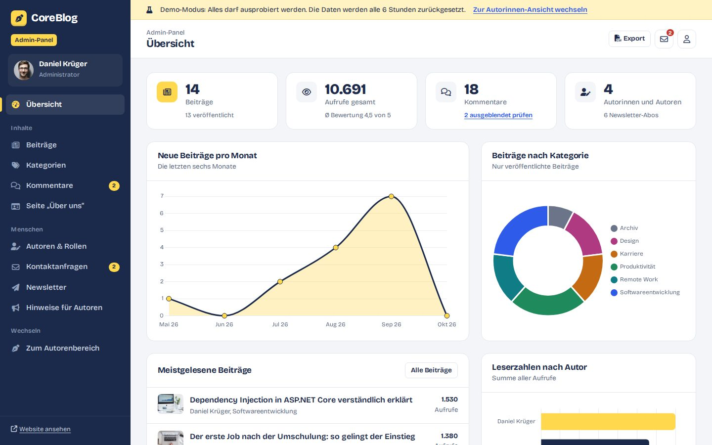
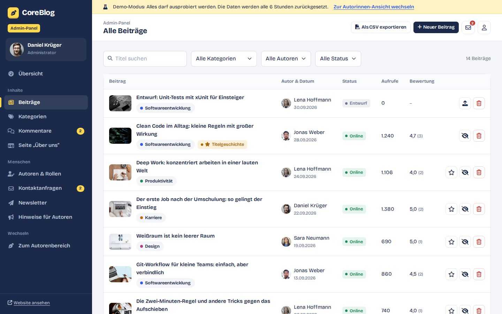
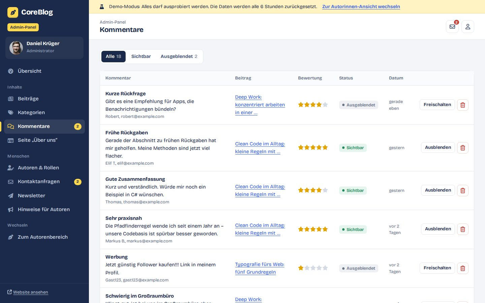
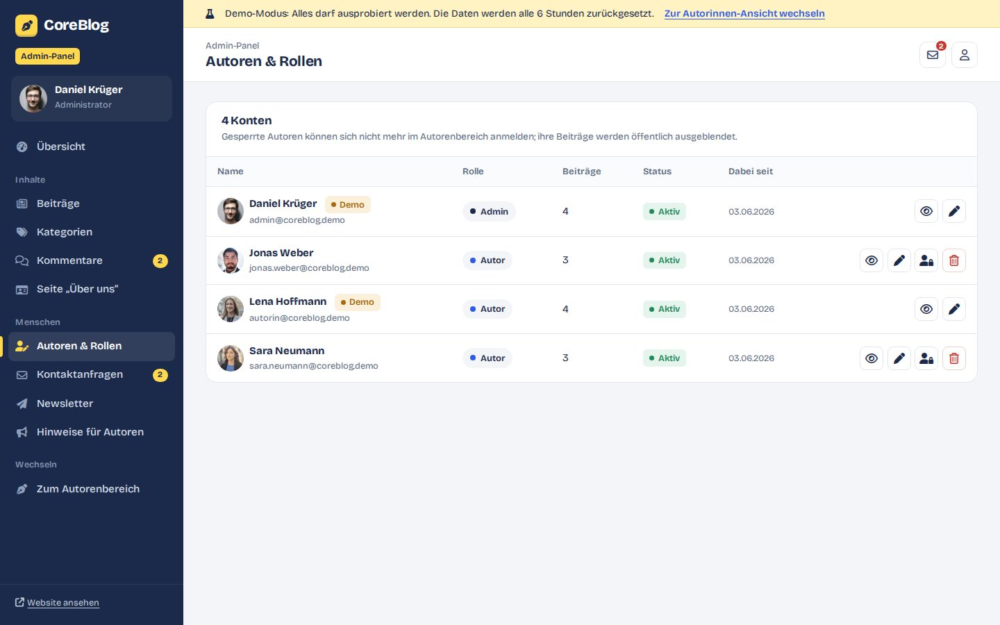
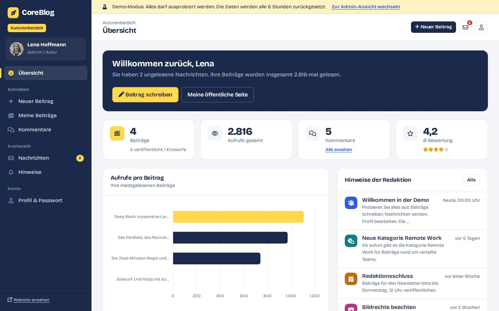
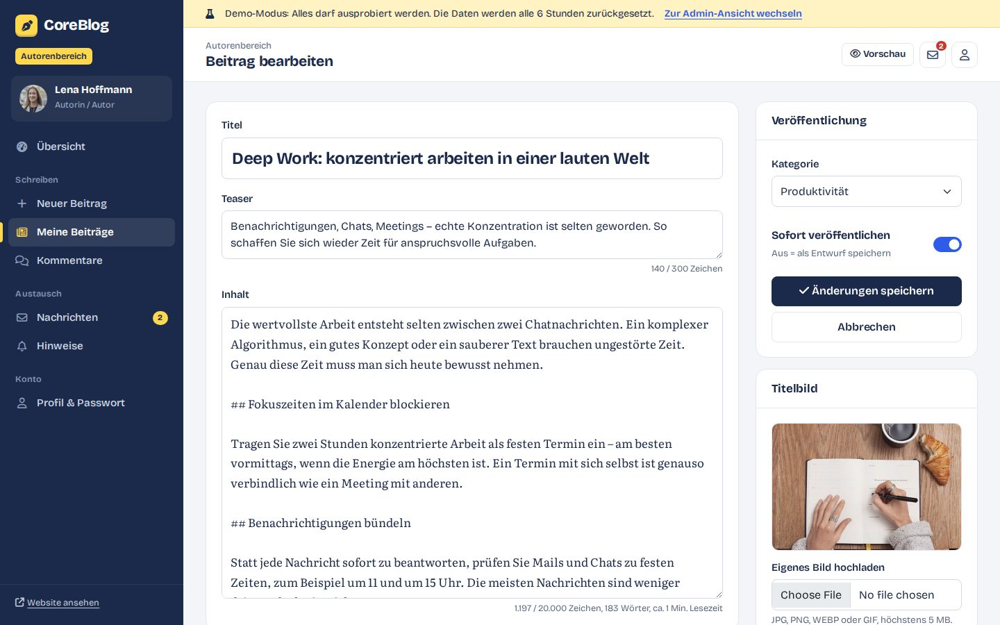
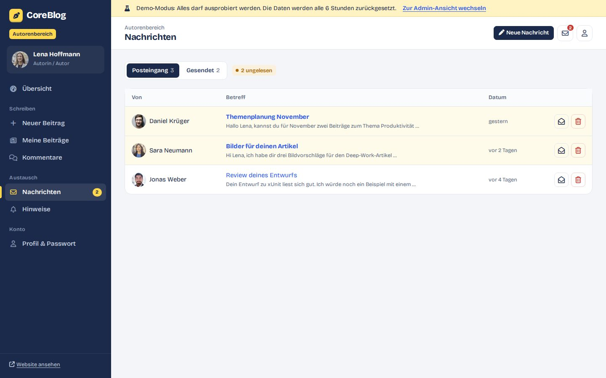

# ✍️ CoreBlog – Blog-Plattform mit ASP.NET Core 8

CoreBlog ist ein Magazin für mehrere Autorinnen und Autoren, gebaut mit **ASP.NET Core 8 MVC**, **Entity Framework Core** und **SQLite**.
Die Anwendung besteht aus einer öffentlichen Website, einem **Autorenbereich** zum Schreiben und Verwalten eigener Beiträge und einem **Admin-Panel** für die Redaktion.

> 🎯 **Live-Demo ohne Registrierung**
> - **Admin-Panel:** `/Demo/Admin`
> - **Autorenbereich:** `/Demo/Writer`
> - Übersicht: `/Demo`
>
> Alle Funktionen dürfen ausprobiert werden. Die Demo-Datenbank wird automatisch alle 6 Stunden zurückgesetzt.

---

## ✨ Funktionen

### 🌐 Öffentliche Website
- Startseite mit Titelgeschichte, neuesten und meistgelesenen Beiträgen
- Volltextsuche und Filter nach Kategorien, Seitennavigation
- Beitragsseite mit Inhaltsverzeichnis, Lesezeit, Aufrufzähler und ähnlichen Beiträgen
- Kommentare mit **Sternebewertung (1–5)**; die Durchschnittsbewertung wird automatisch berechnet
- Autorenseiten, „Über uns“, Kontaktformular mit Validierung, Newsletter-Anmeldung (AJAX)
- Registrierung und Anmeldung mit ASP.NET Core Identity, eigene 403-/404-Seiten

### 🖋️ Autorenbereich (Rolle *Writer*)
- Dashboard mit Kennzahlen, Diagramm (Chart.js), Hinweisen der Redaktion und neuen Kommentaren
- Beiträge schreiben, bearbeiten, löschen, als Entwurf speichern oder veröffentlichen
- Bild-Upload mit Vorschau oder Auswahl aus einer Bildergalerie, Zeichen- und Lesezeitzähler
- Kommentare zu den eigenen Beiträgen
- **Interne Nachrichten** zwischen Autoren (Posteingang, Gesendet, Antworten)
- Profil mit Profilbild und Passwortänderung
- Besitzprüfung: Autoren können nur ihre eigenen Beiträge ändern

### 🛠️ Admin-Panel (Rolle *Admin*)
- Dashboard mit Kennzahlen und drei Diagrammen (Beiträge pro Monat, nach Kategorie, Leserzahlen nach Autor)
- Alle Beiträge filtern, veröffentlichen/zurückziehen, als Titelgeschichte festlegen, löschen, **CSV-Export**
- Kategorien mit Farbe anlegen, bearbeiten, ausblenden und löschen
- Kommentare freischalten, ausblenden und löschen (Bewertung wird neu berechnet)
- Autoren bearbeiten, sperren, löschen und die **Admin-Rolle vergeben**
- Kontaktanfragen, Newsletter-Verteiler (CSV-Export), Hinweise für Autoren, Seite „Über uns“

---

## 🏗️ Architektur

```
CoreBlog.sln
├── BE         → Entitäten (Blog, Category, Comment, Writer, Message, AppUser, AppRole …)
├── DAL        → EF Core Context (SQLite), GenericRepository<T>, Ef…Repository-Klassen
├── BLL        → Services (I…Service) & Manager, FluentValidation, DI-Registrierung
└── CoreBlog   → ASP.NET Core MVC: Controller, Areas (Admin, Writer), Views, Infrastruktur
```

- **N-Tier-Architektur** mit klarer Trennung von Daten, Logik und Präsentation
- **Repository-Pattern** und Manager-Klassen hinter Schnittstellen
- **Dependency Injection** – ein Datenbankkontext pro Anfrage (Scoped)
- **Areas** für Admin-Panel und Autorenbereich mit rollenbasierter Autorisierung
- Bewertungen werden in der Geschäftslogik berechnet (früher SQL-Server-Trigger) – dadurch datenbankunabhängig

---

## 🧩 Technologien
- C#, ASP.NET Core 8 MVC, Razor Views
- Entity Framework Core 8, **SQLite** (Datenbank liegt im Projekt)
- ASP.NET Core Identity mit Rollen, FluentValidation
- HTML, CSS, JavaScript, Bootstrap 5, Chart.js, Font Awesome
- Docker, Render

---

## 🚀 Lokal starten

```bash
git clone https://github.com/amirafshar2/ASP.NETCoreProject.git
cd ASP.NETCoreProject/CoreBlog
dotnet run
```

Oder in Visual Studio `CoreBlog.sln` öffnen und das Projekt **CoreBlog** starten.

- **Keine Datenbank-Installation nötig:** Die SQLite-Datenbank liegt unter `CoreBlog/App_Data/coreblog.db`.
- Fehlt die Datei, wird sie beim Start automatisch angelegt und mit Beispieldaten gefüllt.
- **Demo-Konten** (Passwort `Demo123!`):
  - `admin@coreblog.demo` – Administrator (Daniel Krüger)
  - `autorin@coreblog.demo` – Autorin (Lena Hoffmann)
- Einstellungen in `appsettings.json` → Abschnitt `Demo` (Demo-Modus, Reset-Intervall, Portfolio-, Impressum- und Datenschutz-Links)

---

## ☁️ Deployment (Render, kostenlos)
`Dockerfile` und `render.yaml` sind enthalten:
1. Repository bei [Render](https://render.com) als **Blueprint** verbinden
2. Region *Frankfurt*, Plan *Free* (wird aus `render.yaml` übernommen)
3. Nach dem Deployment ist die Demo unter `https://<name>.onrender.com/Demo` erreichbar

Im Container wird die Demo-Datenbank bei jedem Start und danach alle 6 Stunden neu aufgebaut.

---

## 🔒 Sicherheit & Datenschutz
- Anti-Forgery-Token für alle Formulare (global aktiviert)
- Rollenbasierte Autorisierung und Besitzprüfung bei Beiträgen und Nachrichten
- Blog-Inhalte werden HTML-kodiert ausgegeben (Schutz vor XSS)
- Upload-Prüfung: nur Bilddateien bis 5 MB
- Demo-Konten sind geschützt: Passwort, Rolle und Status können nicht geändert werden
- Schriften, Icons und Skripte werden lokal ausgeliefert – keine Verbindung zu Google Fonts oder CDNs (DSGVO)
- Impressum und Datenschutz verweisen auf [amirrezaafshar.de](https://amirrezaafshar.de)

---

## 🖼️ Screenshots

### 🌐 Website
| Startseite | Beitrag |
|---|---|
|  |  |
| **Demo-Zugang** | **Anmeldung** |
|  |  |

### 🛠️ Admin-Panel
| Dashboard | Beiträge |
|---|---|
|  |  |
| **Kommentare** | **Autoren & Rollen** |
|  |  |

### 🖋️ Autorenbereich
| Dashboard | Editor |
|---|---|
|  |  |
| **Nachrichten** | |
|  | |

---

## 👤 Entwickler
**Amir Reza Afshar** – Umschüler zum Fachinformatiker für Anwendungsentwicklung
🌐 [amirrezaafshar.de](https://amirrezaafshar.de)

Das Projekt entstand ursprünglich als Kursprojekt (ASP.NET-Core-Kurs von Murat Yücedağ) und wurde anschließend von mir eigenständig überarbeitet: Umstellung auf .NET 8 und SQLite, Dependency Injection, vollständiges Admin-Panel und Autorenbereich, neues Design und Demo-Modus.
